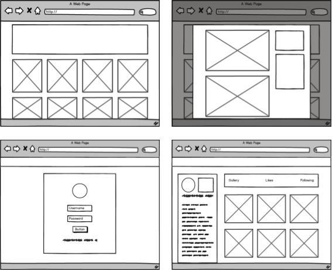

# ArtBook

[](https://github.com/rspec/rspec-rails)
[](https://github.com/facebook/jest)

https://artbookapp.herokuapp.com/

ArtBook is a portfolio showcase web application. It is a full-stack app built using a Ruby on Rails backend, Postgresql database, and React/Redux front-end architecture.

## Planning & Design

<p align="center">

</p>
<p align="center">
<a href="https://github.com/anastassia-b/art-book-app/wiki">Design documents can be found in the wiki!</a>
</p>

## Technologies

### Backend
* Ruby On Rails
* RSpec
* jBuilder
* PostgreSQL RDBMS
* Heroku

### Frontend
* React/Redux
* JavaScript
* Jest
* SCSS/CSS
* npm
* Webpack

### Storage
* Cloudinary for users' profile pictures and project images storage.


## Features & Implementation

**Users:** A user can sign up, log in, and log out. Each user has a profile.

**Projects:** Users own many projects, which are composed of images. Projects can be explored on the dashboard.

**Comments:** Users can comment on projects and delete their own comments.

**Likes:** Users can like and unlike projects. A users liked projects are displayed on their profile.

### Secure Authentication
* BCrypt for password-salting and hashing for a secure authentication system.
* Guest / Demo Account


<p align="center">

</p>

### Modals

Modals were used to implement the Login/Signup session forms, as well as project views.

```jsx
render() {
  const project = this.props.project;
  return (
    <div>
      <div className="project" key={project.id}>
        <section onClick={this.openModal.bind(this)}>
          
        </section>
        <section className="thumbnail-info">
          <span className="project-title">{project.title}</span>
          <Link to={`/users/${project.user_id}`}
                className="artist-name">{project.user}
          </Link>
        </section>
      </div>

      <Modal
        contentLabel="Modal"
        isOpen={this.state.modalOpen}
        onRequestClose={this.closeModal}
        style={style}>

        <div className="x-button">
          <button onClick={this.closeModal}><i aria-hidden="true"></i>
          </button>
        </div>
        <div className="project-detail">
          <ImageIndexContainer project={project}/>
          <ProjectInfoContainer project={project}/>
        </div>
      </Modal>
    </div>
  );
}
```

### Comments and Likes

Users can comment and like projects.

<p align="center">

</p>

## In-Progress

- [ ] Point heroku to custom domain name.
- [ ] Deploy through AWS server and remote Postgres database.
- [ ] Write more backend and frontend tests.
- [ ] Refactor project modal.
- [ ] Refactor api call on a user page.


## Future Features


#### Infinite scroll

This will allow users to keep scrolling to retrieve more content, instead of fetching it all at once.

#### Follows and User-specific Feed

Users will be able to follow each other, allowing for a customizable feed per user.

#### Search by content (tags)

Categorizing projects will allow users to search and filter through projects.

#### Upload projects

Users will be able to upload, edit, and destroy their own projects through the API.
